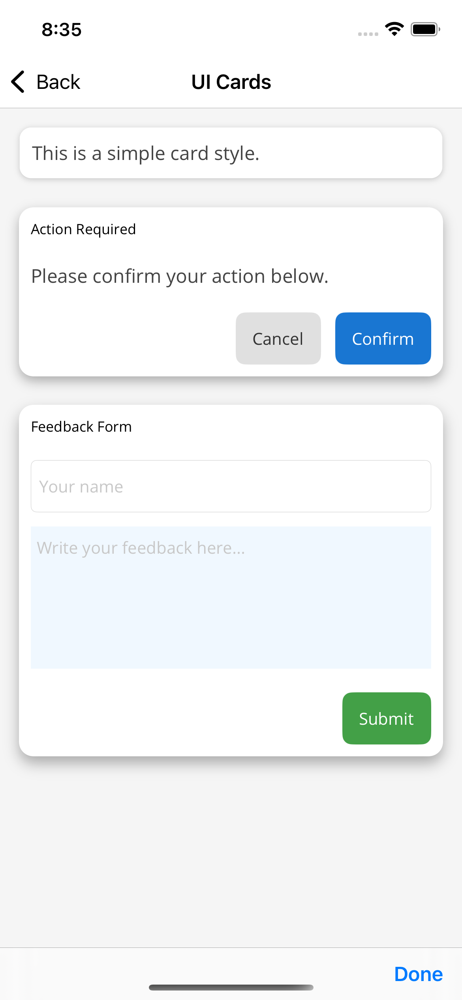
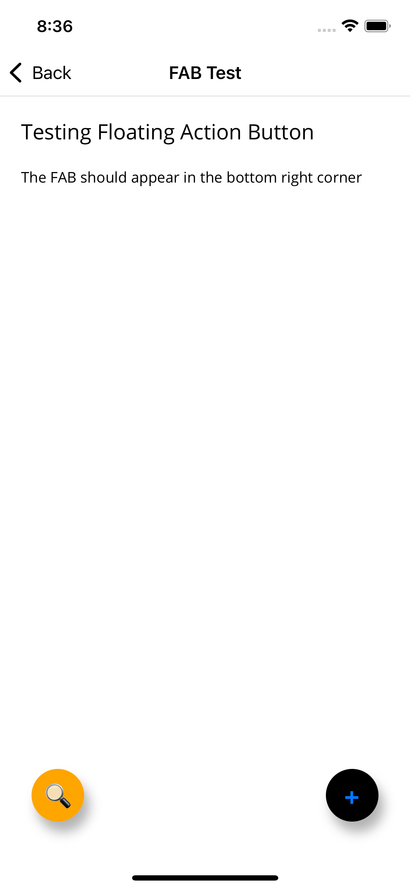

# Zimba.Maui

Zimba.Maui is a custom UI component library for .NET MAUI, designed to simplify and enrich the development of cross-platform apps. It currently features:

- A customizable `Card` control with support for shadows, titles, footers, and dynamic content.
- A `Floating Action Button (FAB)` for quick actions with customizable icons, colors, and animations.

## ✨ Features

### Card Control



The `Card` control supports:

- Title and footer sections
- Adjustable shadows and elevation
- Rounded corners
- Bindable content areas

### Floating Action Button (FAB)



The `Floating Action Button (FAB)` supports:

- Customizable icons and colors
- Smooth animations
- Support for click events

## 📦 Installation

Install the package via NuGet:

```
dotnet add package Zimba.Maui
```

Or search for "Zimba.Maui" in the NuGet Package Manager.

## Controls

### FAB

A Floating Action Button (FAB) for .NET MAUI applications.

#### Usage

Add the namespace to your XAML:

```xml
xmlns:zimba="clr-namespace:Zimba.Maui.Controls;assembly=Zimba.Maui"
```

Then use the control:

```xml
<zimba:FAB
        Command="{Binding AddItemCommand}"
        BackgroundColor="Blue"
        Text="+" />
```

#### Properties

- `Text` - The text displayed on the button (default: "+")
- `BackgroundColor` - The background color of the button
- `Command` - The command to execute when the button is tapped
- `CommandParameter` - The parameter to pass to the command

### Card

A versatile card control with customizable title, content, footer, and shadow options.

#### Usage

Add the namespace to your XAML:

```xml
xmlns:zimba="clr-namespace:Zimba.Maui.Controls;assembly=Zimba.Maui"
```

Then use the control:

```xml
<zimba:Card
    Title="Card Title"
    CardCornerRadius="12"
    HasShadow="True"
    ShowFooterSection="True">

    <zimba:Card.CardContent>
        <Label Text="This is the main content of the card." />
    </zimba:Card.CardContent>

    <zimba:Card.Footer>
        <Button Text="Submit" HorizontalOptions="End" />
    </zimba:Card.Footer>
</zimba:Card>
```

#### Properties

- `Title` - The text displayed in the title section
- `TitleFontSize` - Font size for the title text (default: 12.0)
- `ShowTitleSection` - Whether to display the title section (default: true)
- `CardContent` - The main content of the card
- `Footer` - Content for the footer section
- `ShowFooterSection` - Whether to display the footer section (default: false)
- `CardCornerRadius` - Corner radius for the card (default: 8.0)
- `HasShadow` - Whether the card has a shadow effect (default: true)
- `ShadowOffset` - The offset position of the shadow (default: 2,3)
- `ShadowRadius` - The blur radius of the shadow (default: 5.0)
- `ShadowOpacity` - The opacity of the shadow (default: 0.2)
- `Elevation` - The elevation height of the shadow (default: 2.0)
- `ShadowAngle` - The angle of the shadow in degrees (default: 90.0)

## License

This project is licensed under the MIT License - see the LICENSE file for details.
